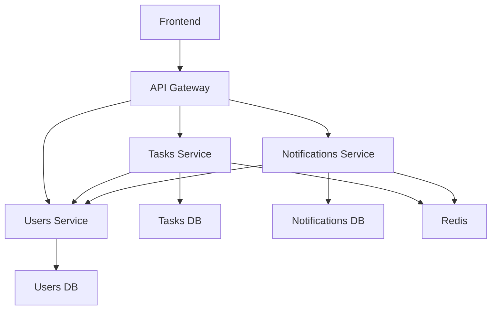

# Task Management System

A modern, full-stack task management application built with **microservices architecture**, featuring real-time notifications, role-based permissions, and a responsive React frontend.

## 🚀 Features

- **📋 Task Management:** Create, update, delete, and organize tasks
- **👥 User Management:** Role-based access control (Admin/User)
- **🔔 Real-time Notifications:** Instant updates for task changes
- **🎯 Advanced Filtering:** Filter tasks by status, priority, due date, and assignee
- **📱 Responsive UI:** Modern React frontend with dark mode support
- **🏗️ Microservices:** Scalable, independent service architecture
- **🔐 Secure Authentication:** Token-based authentication system

## 🏛️ Architecture

```
┌─────────────────┐    ┌──────────────────┐    ┌─────────────────┐
│   Frontend      │    │   API Gateway    │    │  Microservices  │
│   (React)       │◄──►│    (Nginx)       │◄──►│                 │
│   Port: 3000    │    │   Port: 8000     │    │  Users: 8001    │
└─────────────────┘    └──────────────────┘    │  Tasks: 8002    │
                                                │  Notifications  │
┌─────────────────┐    ┌──────────────────┐    │  Port: 8003     │
│   Databases     │    │      Cache       │    └─────────────────┘
│                 │    │                  │
│  Users DB       │    │     Redis        │
│  Tasks DB       │    │   (WebSocket)    │
│  Notifications  │    │                  │
│  (PostgreSQL)   │    │                  │
└─────────────────┘    └──────────────────┘
```

## 🛠️ Tech Stack

### Backend
- **Framework:** Django REST Framework
- **Architecture:** Microservices
- **Database:** PostgreSQL (3 separate instances)
- **Cache:** Redis
- **WebSocket:** Django Channels
- **API Gateway:** Nginx
- **Containerization:** Docker & Docker Compose

### Frontend
- **Framework:** Next.js 14 (React)
- **Styling:** Tailwind CSS
- **State Management:** React Context
- **HTTP Client:** Axios
- **TypeScript:** Full type safety

## 📋 Prerequisites

- **Docker** (v20.0+)
- **Docker Compose** (v2.0+)
- **Node.js** (v18+) - for frontend development
- **Python** (v3.11+) - for backend development

## 🚀 Quick Start

### 1. Clone the Repository
```bash
git clone <repository-url>
cd "Task Management Software"
```

### 2. Start Backend Services
```bash
# Start all microservices
docker-compose up -d

# Wait for services to be ready (30-60 seconds)
docker-compose ps
```

### 3. Initialize Databases
```bash
# Run migrations for each service
docker-compose exec users-service python manage.py migrate
docker-compose exec tasks-service python manage.py makemigrations tasks
docker-compose exec tasks-service python manage.py migrate
docker-compose exec notifications-service python manage.py makemigrations notifications
docker-compose exec notifications-service python manage.py migrate
```

### 4. Create Admin User
```bash
docker-compose exec users-service python manage.py createsuperuser
```

### 5. Start Frontend (Optional)
```bash
cd frontend
npm install
npm run dev
```

### 6. Access the Application
- **Frontend:** http://localhost:3000
- **API Gateway:** http://localhost:8000/api/
- **API Documentation:** [API_DOCUMENTATION.md](./API_DOCUMENTATION.md)

### 7. Test the Setup
```bash
# Run API tests
python test_apis.py
```

## 📁 Project Structure

```
Task Management Software/
├── backend/
│   ├── services/
│   │   ├── users-service/         # Authentication & user management
│   │   │   ├── users/             # Django app
│   │   │   ├── settings.py        # Service configuration
│   │   │   ├── manage.py          # Django management
│   │   │   └── Dockerfile         # Container definition
│   │   ├── tasks-service/         # Task CRUD & business logic
│   │   │   ├── tasks/             # Django app
│   │   │   ├── settings.py        # Service configuration
│   │   │   ├── asgi.py           # WebSocket support
│   │   │   └── Dockerfile         # Container definition
│   │   └── notifications-service/ # Notification system
│   │       ├── notifications/     # Django app
│   │       ├── settings.py        # Service configuration
│   │       └── Dockerfile         # Container definition
│   └── gateway/                   # Nginx API Gateway
│       ├── nginx.conf            # Routing configuration
│       └── Dockerfile            # Container definition
├── frontend/                      # Next.js React application
│   ├── src/
│   │   ├── app/                  # App router pages
│   │   ├── core/                 # Shared utilities
│   │   └── components/           # Reusable components
│   ├── package.json              # Dependencies
│   └── tailwind.config.js        # Styling configuration
├── docker-compose.yml             # Service orchestration
├── README.md                      # This file
└── API_DOCUMENTATION.md           # Complete API reference
```

## 🔗 API Overview

All API requests go through the **API Gateway** at `http://localhost:8000/api/`

### 🔐 Authentication
- `POST /auth/login/` - User login
- `POST /auth/logout/` - User logout
- `GET /auth/verify/` - Token verification

### 📋 Tasks
- `GET /tasks/` - List tasks (with filtering)
- `POST /tasks/` - Create new task
- `GET /tasks/{id}/` - Get specific task
- `PUT /tasks/{id}/` - Update task
- `PATCH /tasks/{id}/` - Partial update
- `DELETE /tasks/{id}/` - Delete task

### 🔔 Notifications
- `GET /notifications/` - List user notifications
- `PATCH /notifications/{id}/` - Mark as read

**📖 Complete API Documentation:** [API_DOCUMENTATION.md](./API_DOCUMENTATION.md)

## 🗄️ Database Schema

### Users Service Database
```sql
User {
  id: Primary Key
  username: Unique String
  email: String
  role: Enum(admin, user)
  password: Hashed String
  is_active: Boolean
  date_joined: DateTime
  last_login: DateTime
}
```

### Tasks Service Database
```sql
Task {
  id: Primary Key
  title: String(200)
  description: Text
  priority: Enum(low, medium, high)
  status: Enum(todo, in_progress, completed)
  due_date: Date
  assigned_user: Integer (User ID)
  created_at: DateTime
  updated_at: DateTime
}
```

### Notifications Service Database
```sql
Notification {
  id: Primary Key
  user: Integer (User ID)
  message: String(255)
  is_read: Boolean
  created_at: DateTime
}
```

## 🔐 Authentication & Security

### Token-Based Authentication
```http
Authorization: Token your_token_here
```

### Security Features
- **🔒 Token Validation:** All services validate tokens with users service
- **👤 Role-Based Access:** Admin and user roles with appropriate permissions
- **🛡️ CORS Protection:** Configured for cross-origin requests
- **🔍 Request Logging:** Comprehensive logging for debugging and monitoring

### Default Users
After running migrations, create users via Django admin or API:
- **Admin:** Full access to all resources
- **User:** Access only to assigned tasks

## ✨ Key Features

### Task Management
- **📝 CRUD Operations:** Create, read, update, delete tasks
- **🎯 Advanced Filtering:** Filter by status, priority, due date, assignee
- **📊 Kanban Board:** Visual task organization
- **📋 Table View:** Detailed task listing

### Real-time Features
- **🔔 Instant Notifications:** Real-time updates for task changes
- **🔄 Auto-refresh:** Periodic polling for updates
- **📱 Responsive UI:** Works on desktop and mobile

### User Experience
- **🌙 Dark Mode:** Built-in dark theme support
- **🔐 Secure Login:** Token-based authentication
- **👥 Role Management:** Admin and user permissions
- **📱 Mobile Friendly:** Responsive design

## 🔄 Real-time Updates

### Current Implementation
- **Polling:** Frontend polls for notifications every 30 seconds
- **Auto-notifications:** Tasks automatically create notifications via Django signals
- **Instant UI Updates:** Optimistic updates for better UX

### WebSocket Support (Planned)
```javascript
// Future WebSocket implementation
ws://localhost:8000/ws/notifications/

// Event format
{
  "type": "notification",
  "notification": {
    "id": 1,
    "message": "Task updated",
    "is_read": false
  }
}
```

## 🔄 Service Communication



- **🌐 API Gateway:** Single entry point, routes requests to appropriate services
- **🔐 Authentication Flow:** Services validate tokens with users service
- **📡 Inter-service Communication:** HTTP-based service-to-service calls
- **💾 Database Isolation:** Each service has its own database

## 👥 User Roles & Permissions

| Feature | Admin | User |
|---------|-------|------|
| View all tasks | ✅ | ❌ |
| View assigned tasks | ✅ | ✅ |
| Create tasks | ✅ | ✅ |
| Edit any task | ✅ | ❌ |
| Edit assigned tasks | ✅ | ✅ |
| Delete any task | ✅ | ❌ |
| Delete assigned tasks | ✅ | ✅ |
| View all notifications | ✅ | ❌ |
| View own notifications | ✅ | ✅ |
| User management | ✅ | ❌ |

## 📊 Monitoring & Logging

### Logging Configuration
- **Level:** DEBUG (development) / INFO (production)
- **Format:** `{levelname} {asctime} {module} {message}`
- **Output:** Console (Docker logs)
- **Coverage:** All microservices with individual log streams

### Viewing Logs
```bash
# View all services
docker-compose logs -f

# View specific service
docker-compose logs -f users-service
docker-compose logs -f tasks-service
docker-compose logs -f notifications-service
docker-compose logs -f gateway
```

## 🛠️ Development

### Backend Development
```bash
# View service logs
docker-compose logs -f <service-name>

# Restart specific service
docker-compose restart <service-name>

# Scale services
docker-compose up --scale tasks-service=2

# Access service shell
docker-compose exec users-service bash

# Run Django commands
docker-compose exec users-service python manage.py shell
```

### Frontend Development
```bash
cd frontend

# Install dependencies
npm install

# Start development server
npm run dev

# Build for production
npm run build

# Run type checking
npm run type-check
```

### Database Management
```bash
# Create migrations
docker-compose exec <service> python manage.py makemigrations

# Apply migrations
docker-compose exec <service> python manage.py migrate

# Access database
docker-compose exec <db-service> psql -U postgres -d <database>
```

## 🚀 Deployment

### Production Considerations
- **Environment Variables:** Configure via `.env` files
- **Database:** Use managed PostgreSQL service
- **Redis:** Use managed Redis service
- **SSL/TLS:** Configure HTTPS in production
- **Monitoring:** Add application monitoring (e.g., Sentry)
- **Backup:** Implement database backup strategy

### Docker Production
```bash
# Build production images
docker-compose -f docker-compose.prod.yml build

# Start production services
docker-compose -f docker-compose.prod.yml up -d
```

## 🆘 Troubleshooting

### Common Issues

**Services not starting:**
```bash
# Check service status
docker-compose ps

# View error logs
docker-compose logs <service-name>
```

**Database connection errors:**
```bash
# Restart database services
docker-compose restart users-db tasks-db notifications-db

# Check database logs
docker-compose logs users-db
```

**Frontend not connecting to API:**
- Verify API Gateway is running on port 8000
- Check CORS configuration in backend services
- Ensure environment variables are set correctly

**Port conflicts:**
```bash
# Check what's using the ports
netstat -tulpn | grep :8000

# Stop conflicting services or change ports in docker-compose.yml
```

---

**Built with ❤️ using Django, React, and Docker**
